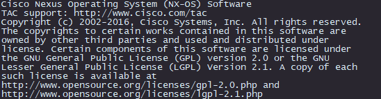

# Terminal Color Settings

Having a terminal color scheme that fits nice can really make or break your productivity.  Eye strain can cause headaches, fogginess, or even permanent vision damage.

## SecureCRT Settings

### Built-In Chalkboard

> Background: R41 G38 B47  
> Foreground: R217 G230 B242

### Smooth Neutral (Custom)

> Background:  R143 G164 B179  
> Foreground:  R229 G244 B255  
> Bold Foreground: R255 G255 B204  

